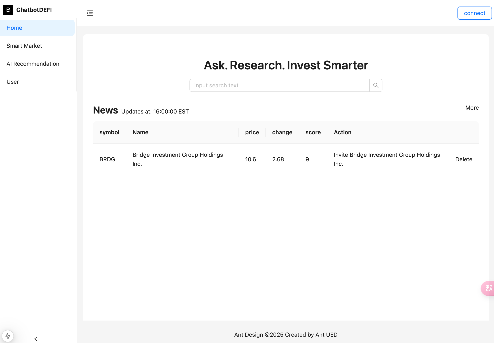
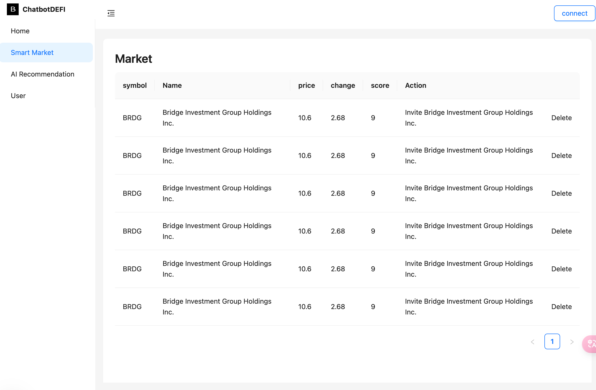
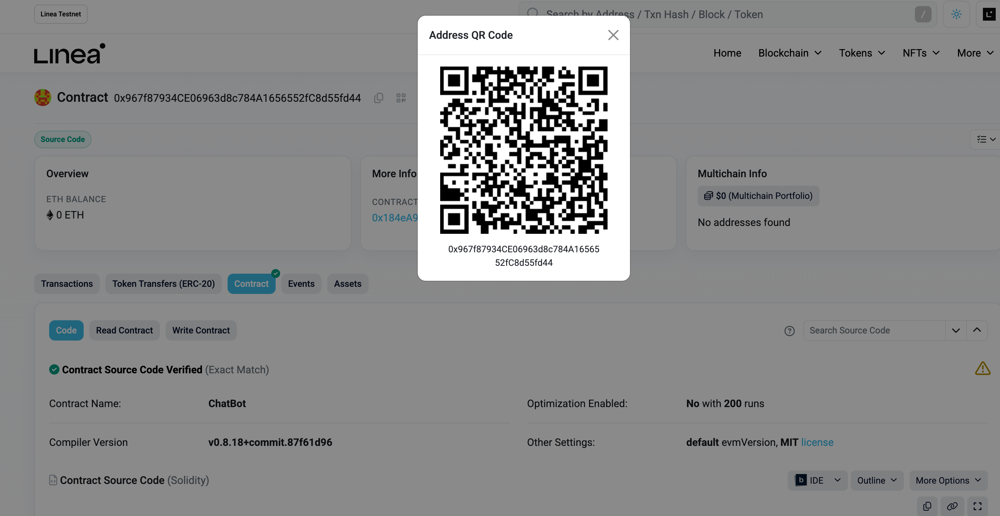

# 项目介绍
  这是一个这是一个智能投资平台，用户可以注册和登录，然后通过智能对话机器人获取投资建议，利用AI算法分析链上数据，为用户提供投资建议或风险预警。

  项目采用nextjs作为前端框架，使用Ant Design作为UI库，Node.js作为后端框架，Express作为Web服务器，Solidity作为智能合约语言，MySQL作为数据库，Web3.js作为与区块链交互的库，百度文心一言作为智能对话机器人。

  Chatbot integrates user management, intelligent conversation, on-chain data analysis and other functions.

  Can provide users with investment advice, risk warning, support asset allocation and trading. Through one-stop service, intelligent decision-making, and security protection, we will break down the barriers to digital asset investment and lead a new experience of efficient and safe investment.


# 项目结构
- 前端：nextjs
- 后端：基于Node.js框架，使用Express框架
- 数据库：基于MySQL数据库

# 项目功能
- 用户注册和登录
- 智能对话机器人：运用自然语言处理技术，实现与用户的自然流畅交互。平台能够根据用户输入的问题，生成专业、精准的投资建议，涵盖投资方向、资产配置等方面。同时，基于实时数据和算法模型，及时为用户提供风险预警提示，帮助用户规避潜在风险。
- 投资组合分析：利用AI算法分析用户的资产配置，提供优化建议。以直观的方式展示用户的资产配置情况，包括不同数字资产的占比、市值等信息。通过专业的算法和模型，为用户提供个性化的投资组合优化建议，帮助用户实现资产的合理配置。同时，精准统计投资组合的收益与亏损情况，让用户对投资绩效一目了然。
- 市场趋势分析：实时监控数字资产市场行情，包括价格走势、交易量等关键数据。运用大数据分析和人工智能技术，预测市场趋势，帮助用户把握市场动态。此外，通过对市场的深度挖掘，为用户发现潜在的投资机会，如新兴项目、价值低估资产等。
- 风险评估与预警：构建科学的风险评估模型，从多个维度对用户的投资风险进行评估。用户可以根据自身风险承受能力设置风险阈值，当投资风险超出阈值时，平台及时向用户发送预警通知，提醒用户采取相应措施。
- 链上数据分析：为用户提供全方位的链上数据洞察服务。用户可以实时查询钱包余额，清晰了解自己的资产状况；深入分析交易历史，包括交易时间、金额、对手方等信息，从中总结投资规律；实时监控 DeFi 持仓情况，掌握各类去中心化金融产品的价值波动。
- 自动化交易：提供策略回测功能，用户可以在模拟环境中测试自己的交易策略，评估策略的有效性和盈利能力。平台支持自动执行交易功能，用户可以根据设定的条件，让系统自动完成交易操作，提高交易效率。此外，能够实时追踪交易收益，为用户提供详细的收益报表。
- 教育功能：搭建丰富的投资知识库，涵盖数字资产基础知识、投资策略、市场分析方法等内容。为新手用户提供详细的引导教程，帮助他们快速上手数字资产投资。同时，设置常见问题解答板块，方便用户随时查询解决遇到的问题。
- 社交功能：支持用户之间分享投资策略，促进知识和经验的交流。用户可以参与社区讨论，与其他投资者互动，分享观点和见解。此外，平台还提供专家咨询服务，用户可以向行业专家请教问题，获取专业建议。

# Feature

Intelligent conversation

The platform can generate professional and accurate investment suggestions based on user input questions. At the same time, based on real-time data and algorithm model, timely risk warning tips are provided to users to help users avoid potential risks.

2. On-chain data analysis

Users can query the balance of the wallet in real time and clearly understand their asset status; In-depth analysis of transaction history, including transaction time, amount, counterparty and other information, to summarize investment rules; Monitor DeFi holdings in real time and understand the value fluctuations of various decentralized financial products.

3. Portfolio management

Display the user's asset allocation situation in an intuitive way, including the proportion of different digital assets, market value and other information.

Through professional algorithms and models, we can provide users with personalized portfolio optimization suggestions to help users achieve reasonable asset allocation.

At the same time, the accurate statistics of the income and loss of the investment portfolio, so that users can be clear about the investment performance.

4. Market analysis

Monitor the digital asset market in real time, including price trend, trading volume and other key data. Use big data analysis and artificial intelligence technology to predict market trends and help users grasp market dynamics.

In addition, through in-depth mining of the market, we can find potential investment opportunities for users, such as emerging projects and undervalued assets.

5. Educational function

Build a rich investment knowledge base, covering basic knowledge of digital assets, investment strategies, market analysis methods and other content.

Provide detailed guided tutorials for novice users to help them quickly get started in digital asset investing. At the same time, the frequently asked questions section is set up to facilitate users to inquire and solve the problems encountered at any time.

6. Automate trading

Provide strategy backtest function, users can test their own trading strategy in a simulated environment, evaluate the effectiveness and profitability of the strategy.

The platform supports the function of automatic transaction execution, and users can make the system automatically complete the transaction operation according to the set conditions to improve the transaction efficiency.

In addition, it can track trading income in real time and provide users with detailed income reports.

7. Social features

Support the sharing of investment strategies among users and facilitate the exchange of knowledge and experience.

Users can participate in community discussions, interact with other investors, and share views and insights.

8. Cross-chain support

to achieve unified management of multi-chain assets, users can easily manage assets on different blockchains on one platform.

Provides cross-chain transaction advice to help users transfer and trade assets between different blockchains. At the same time, the risk of cross-chain transactions is assessed to ensure the security of users' cross-chain transactions.

9. Security function

Strict audit of the smart contracts involved in the platform to ensure the security and reliability of the contract code. When the user trades, timely prompt trading risks, such as price fluctuation risk, counterparty risk, etc.

In addition, provide users with security protection suggestions, including wallet security Settings, password protection, etc., to ensure the security of user assets.

# 技术栈
- React
- Ant Design
- Node.js
- Express
- Solidity
- Ganache
- Web3.js
- BaiduAI API
- 其他

# 部署
编译智能合约：npx hardhat compile
部署测试：npx hardhat run scripts/deploy.js --network linea_testnet // 部署到Linea测试网
部署主网：npx hardhat run scripts/deploy.js --network linea_mainnet // 部署到Linea测试网
部署本地：npx hardhat run scripts/deploy.js --network localhost

# 项目截图



Try running some of the following tasks:

```shell
npx hardhat help
npx hardhat test
REPORT_GAS=true npx hardhat test
npx hardhat node
npx hardhat ignition deploy ./ignition/modules/Lock.js
```

# 合约
contract address：0x967f87934CE06963d8c784A1656552fC8d55fd44
blockchain network： linea_testnet(LineETH testnet)


